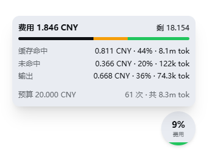

# dsh-billing — DeepSeek Harness 实时计费插件

《深入拆解 DeepSeek Harness》随书代码：事件溯源实时计费（峰谷价格表）。账单是"会话日志 + 部署价格表"的纯函数，零上下文注入；Web 客户端右下角的悬浮水满仪表实时显示**当前单个会话**的账单（统计的是当前选中的会话，不是全部会话的费用汇总）。



## 安装

从 GitHub Releases 下载打包产物（仅含 `lib/` 构建产物，无需源码构建），安装到 dsh 部署目录：

```sh
# 1. 下载 release 产物（请把 v0.1.0 换成最新版本号）
curl -LO https://github.com/imeepos/dsh-billing-plugin/releases/latest/download/dsh-billing-0.1.0.tgz
# 2. 在 dsh 部署目录安装（写入依赖，cordis 加载器即可解析到该插件）
npm install ./dsh-billing-0.1.0.tgz
```

> 注意：目标机器连不上 GitHub 时（如国内网络），可先从可达机器把 tarball 传过去，安装本身只依赖本地文件。

> 从源码安装（开发用途）：`git clone <本仓库地址> && cd billing-plugin && npm install && npm run build && npm run build:client && npm install <路径>/dsh-billing-0.1.0.tgz`

## 配置

在 profile 的 `cordis.patch.yml`（`~/.dsh/profiles/<你的profile>/`）中追加（**必须用 `- insert:` 列表**，patch 层只能对已有条目覆盖，顶层直接写条目会报 `entry "billing" not found`）：

```yaml
- insert:
    - id: billing
      name: dsh-billing
      config:
        currency: CNY
        budget: 0.05                      # 每 session 预算
        prices:
          deepseek-v4-flash:
            offPeak: { inputPerMillion: 1.5, outputPerMillion: 4.5, cacheReadPerMillion: 0.05 }
            peak:    { inputPerMillion: 3.0, outputPerMillion: 9.0, cacheReadPerMillion: 0.10 }
          deepseek-v4-pro:
            offPeak: { inputPerMillion: 4.5, outputPerMillion: 13.5, cacheReadPerMillion: 0.15 }
            peak:    { inputPerMillion: 9.0, outputPerMillion: 27.0, cacheReadPerMillion: 0.30 }
```

然后用下面的命令确认插件已挂载（插件树中应出现 `# == ...cordis.patch.yml` 段落的 `id: billing`）：

```sh
dsh --profile <你的profile> --dump-config   # 插件树中应出现 id: billing
```

## 一键安装（发给 AI 助手）

把下面整段复制发给任意 AI 助手（Claude Code / Codex / dsh 自身），它会替你完成安装与配置（已按 102 服务器实测通过）：

````markdown
请帮我安装并配置 dsh-billing（DeepSeek Harness 实时计费插件），profile 为 web：

1. 下载插件产物到服务器临时目录：
   curl -LO https://github.com/imeepos/dsh-billing-plugin/releases/latest/download/dsh-billing-0.1.0.tgz
   （如果该 URL 不可达，提示我先把 dsh-billing-0.1.0.tgz 传到这台机器再继续）

2. 在 web profile 目录安装：
   cd ~/.dsh/profiles/web
   cp /tmp/dsh-billing-0.1.0.tgz .
   npm install ./dsh-billing-0.1.0.tgz
   检查 ~/.dsh/profiles/web/package.json 的 dependencies 出现
   "dsh-billing": "file:dsh-billing-0.1.0.tgz"

3. 编辑 ~/.dsh/profiles/web/cordis.patch.yml，在末尾追加
   （如果文件内容只是注释，把注释删掉换成下面的内容；注意必须用 insert 列表语法）：

   - insert:
       - id: billing
         name: dsh-billing
         config:
           currency: CNY
           budget: 0.05
           prices:
             deepseek-v4-flash:
               offPeak: { inputPerMillion: 1.5, outputPerMillion: 4.5, cacheReadPerMillion: 0.05 }
               peak: { inputPerMillion: 3.0, outputPerMillion: 9.0, cacheReadPerMillion: 0.10 }
             deepseek-v4-pro:
               offPeak: { inputPerMillion: 4.5, outputPerMillion: 13.5, cacheReadPerMillion: 0.15 }
               peak: { inputPerMillion: 9.0, outputPerMillion: 27.0, cacheReadPerMillion: 0.30 }

4. 验证挂载：dsh --profile web --dump-config
   插件树中应出现 id: billing（来源 cordis.patch.yml）。

5. 如果第 4 步报 patch: entry "billing" not found，
   说明没写进 insert 列表，回到第 3 步检查。
   任何一步失败，把完整报错贴给我，我会修复后重试。
````

## 配置字段说明

| 字段 | 默认值 | 含义 |
|---|---|---|
| `currency` | `CNY` | 币种代码，所有金额均以此显示。 |
| `prices` | `{}` | 按模型 id 的峰谷价格表（见下表）；未配置的模型按 0 计费。 |
| `peakWindows` | `[[9, 12], [14, 18]]` | 峰时窗口，`[start, end)` 整点区间（配置时钟）。 |
| `utcOffsetMinutes` | `480` | 东偏 UTC 分钟数，480 = 北京时间（UTC+8）。 |
| `budget` | 未设置 | 每 session 预算：仅作为账单字段（`budget` / `remaining` / `exhausted`）供 UI 展示，不做任何限制。 |

`prices` 中每个模型的价格桶（`offPeak` 非峰、`peak` 峰时）字段：

| 字段 | 含义 |
|---|---|
| `inputPerMillion` | 每百万输入 token（缓存未命中）价格。 |
| `outputPerMillion` | 每百万输出 token 价格。 |
| `cacheReadPerMillion` | 每百万缓存命中输入 token 价格（省略按 0）。 |
| `cacheWritePerMillion` | 每百万缓存写入 token 价格（省略按 0）。 |
| `effectiveFrom` | 价格表生效时间（Unix 毫秒时间戳），此前的调用按 0 计费，用于提前部署新价格表。 |

## 使用

启动后 Web 客户端右下角出现可拖动的悬浮水满仪表，**只统计当前选中的单个会话**（切换到其他会话后，仪表会实时刷新为该会话的账单，不会累加所有会话的费用）：

- **水满高度**：当前会话费用占预算的百分比；按消耗分四档颜色：绿（<25%）、蓝（25–50%）、橙（50–75%）、红（≥75%）。
- **单击仪表**：展开/收起明细面板，显示当前会话的费用与剩余预算、缓存命中 / 未命中 / 输出占比及 token 数、调用次数。
- **拖动仪表**：移动位置，位置保存在浏览器 localStorage。

未配置 `budget` 时仪表高度恒为 0，明细面板仍显示当前会话的完整费用与 token 分解。

## License

MIT。
